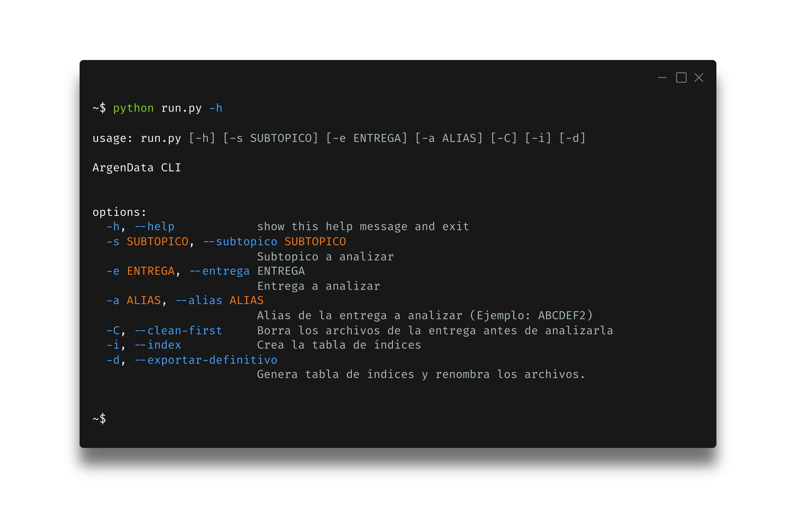

<div align="left">
 </img>
</div>

&nbsp;


<!--
<div align='center'>
 </img>
</div>
-->

**_QA_** tiene como objetivo principal dar estructura al proyecto **Argendata** para simplificar los procesos de creación y ejecución de controles sobre los _datasets_, haciendo que el código escale más y mejor.

# Uso

El proyecto cuenta con una interfaz mínima de consola con parámetros y ayuda para cambiar la funcionalidad:



> [!CAUTION]
> Si pasamos `-C` o `--clean-first` se borra TODO el contenido del cache (`tmp/`) y de los resultados (`output/`).
> Es una buena idea usarlo para asegurarse que no haya datos viejos o basura que puedan contaminar el resultado.
> Pero hay que tener cuidado con borrar _outputs_ que ya eran correctos.

## Correr sólo verificaciones

Sólo debe especificarse un subtópico con el número de entrega:
Algunos ejemplos válidos:

```python
python run.py --alias SUBTOP2
```


```python
python run.py -a SUBTOP2
```


```python
python run.py -s SUBTOP -e 2
```


```python
python run.py --subtopico SUBTOP --entrega 2
```

## Generar IDs

El parámetro `--index` genera sólo la tabla de IDs, `--exportar-definitivo` lo hace como uno de sus pasos.

```python
python run.py -a SUBTOP1 -i
```


```python
python run.py -a SUBTOP1 --index
```

## Cerrar un subtópico (pasar a definitivo)

La diferencia con `--index` es que acá remappea los `.csv` con los nombres correspondientes para que matcheen 1:1 gráfico:dataset.

```python
python run.py -a SUBTOP1 -d
```

```python
python run.py -a SUBTOP1 --exportar-definitivo
```

# QA

La sección de _**QA (Quality Assurance)**_ debe ejecutar una seria de controles para todos sus _datasets_. Los controles están estructurados de manera jerárquica, de forma tal que existen algunos de nivel superior que llaman a otros de nivel inferior.

Por ejemplo, los `Controles` de `Subtopicos`, llaman a `Controles` de `Archivo` para analizar `.csv`s (_Encoding_, _delimiter_), y `Controles` de `Consistencia` (Diferencias entre lo declarado en la plantilla y lo efectivo en un _dataset_).
Etc.

```
Subtopico
|
|\_Archivo
|
 \_Consistencia
 
 ...

```

El _entry point_ del programa de QA es 'main.py'. Ejecuta primero los tests unitarios y después el código.
