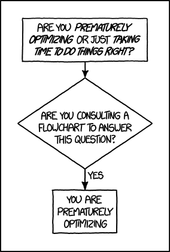
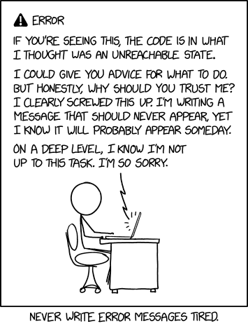

<div align='center'>
    <h1>ArgenData</h1>
    <h3>Guía de uso y contribución</h3>
</div>

## Introducción y motivación

ArgenData es un proyecto grande, con distintas partes que interactúan ya sea simultéaneamente o asincrónicamente, es por ésto que las mismas deberían estar bien definidas y lo más desacopladas entre sí, es decir que cambiar la lógica de funcionamiento de una sección que se encarga de una tarea, no debería modificar en gran escala (preferentemente, en absoluto) la lógica de otras que dependen de ésta. Sin embargo, no sólo es importante que el diseño de piezas preexistentes sea limpio, sino que la arquitectura sea lo suficientemente flexible como para adaptarse y crecer; ArgenData se beneficia de ser un proyecto arraigado en procesos incrementales e iterativos. Es entonces, el motivo de esta documentación, asegurar un conjunto de estándares internos respecto al nivel de limpieza y mantenibilidad del código que preserven la flexibilidad y adaptabilidad de la arquitectura.

No obstante, es importante aclarar que el objetivo de esta guía **no** es fijar un conjunto de reglas estrictas por el mero hecho de formalizar un dialecto particular, sino más bien una serie de consideraciones que deben tenerse en cuenta _antes_, _durante_ y _después_ de escribir código que resuelva alguna tarea en particular. Más aún, el objetivo de tener estas consideraciones es reducir cuanto sea posible la fricción del proceso productivo.

## Estilo del código

La mayoría del código de ArgenData está escrito en Python. Esto no significa que sea la única forma de contribuir código, de hecho, la idea de modularizar el proyecto tiene en cuenta que sería beneficioso admitir funcionalidades escritas en otros lenguajes, ya sea como scripts standalone, o como pipelines propias.

### Mentalidad y principios

Indistintamente del lenguaje en el que esté escrito, es buena idea mantener una mentalidad consistente al escribir código. Algunos aspectos a considerar:

#### 1. Iteratividad

<div align='center'>
<i>
    "La optimización prematura es la raíz de todos los males"
</i>

<div align='right'>
    <i>Donald Knuth - Structured Programming, 1974</i>
</div>
</div>

---

Antes de entrar en cualquier detalle, es importante tener en cuenta que la calidad del código tiene que ser vista como un proceso _iterativo_. Si bien la frase sobre la optimización prematura refiere al rendimiento de los algoritmos, lo mismo podemos pensar de cualquier optimización, incluso respecto a la estructura o legibilidad del código.

Sobrepensar no sólo puede ser un proceso agobiante y ralentizador, sino que incluso hasta contraproducente para la calidad de lo que escribimos. Todo en su justa medida: es útil tener consideraciones futuras sobre el resultado, pero ante una situación de parálisis de análisis, el mejor antídoto es empezar por algún lado y apostar a mejorar la calidad de la primera iteración en posteriores revisiones.

<div align='center'>
</img>

<div>
<a href='https://www.xkcd.com/1691'>
<small>"1691: Optimization" - xkcd</small>
</a>
</div>
</div>

Por ejemplo, en caso de agregar una funcionalidad, primero es importante definir _cuál_ es la funcionalidad, lo cuál puede hacerse sin programar, pero a la hora de escribir código es preferible tener un borrador **funcional** a no tener borrador. Para que ese primer acercamiento sea verdaderamente útil, debe estar debidamente documentado.

#### 2. Modularidad

Que el código sea _modular_ puede significar dos cosas, que no son mutualmente excluyentes:

- **Reusabilidad:** Relacionado al concepto de _bibliotecas_, es código empaquetado en una caja, utilizable donde sea, sin que esté acoplado a otros funcionamientos.

- **Intercambiabilidad:** Relacionado al concepto de _plug-ins_, es la capacidad del código de poder intercambiar información con otros componentes a través de interfaces compartidas bien definidas - Como un contrato entre ambas partes. 

La _reusabilidad_ permite crear código que sea independiente de otros componentes, de forma tal que conoce muy bien la tarea que realiza y por eso lo hace eficazmente. Internamente puede estar fuertemente acoplado para poder cumplir con su responsabilidad, pero aquel que lo utiliza no tiene que (ni debe) conocer su funcionamiento interno.

La _intercambiabilidad_ nos permite hacer _mix and match_ entre componentes que realizan la misma tarea, pero que internamente funcionan distinto. El diseño intercambiable es bidireccional, incluye diseñar módulos con una interfaz bien definida, la cual debe estar considerada en el diseño de aquellos con los cuales interactúa. De ésta manera, los módulos que tengan el mismo efecto pero implementaciones diferentes, no cambia la implementación general del programa. De esta manera, cambiar las estrategias a través la cual se cumplen ciertas tareas simplemente consiste en escribir la lógica de un comportamiento nuevo que luego se conecte de manera limpia con el resto del programa (En cambio de tener que cambiar todo el funcionamiento del programa para adaptar el código nuevo).

ArgenData hace **gran** uso de patrones modulares, dado que uno de los problemas fundamentales es desacoplarnos de las herramientas externas que se usaron para generar los documentos. Es por esto que, internamente, necesitamos tener interfaces claras y bien definidas para luego adaptar los elementos recolectados a procesar, y también para poder asegurar una calidad en los resultados. 

Grandes ejemplos de estos son los `Verificadores` y los _controles de calidad_, ambos sistemas son altamente modulares: admiten adiciones de código de una manera sencilla, de forma tal que si cumplen con cierto formato, la pipeline considera la contribución automáticamente, sin necesidad de escribir código por fuera de lo que le corresponde a la nueva incorporación.

También es importante tener en cuenta la modularidad para separar responsabilidades entre módulos escritos en distintos lenguajes de programación. Al igual que se menciona previamente, se admite y promueve contribuir con código programado en otros lenguajes aparte de Python, siempre y cuando sea fácilmente adaptable. Para lograr esto último, tener en cuenta la modularidad es clave.

Como _bonus_, tener las responsabilidades bien separadas, hace también más sencilla la tarea de testar los componentes. No sólo porque un módulo bien testeado puede ser reutilizado, sino porque también un componente que acepte otros a través de una interfaz en común, también admite _mock-ups_ de los mismos, por ende si su comportamiento depende de aquello con lo que interactúe, entonces es posible escribir componentes que ayuden a testear el mismo.

#### 3. Trazabilidad

<div align='center'>
<i>
    "Los errores nunca deben pasar desapercibidos. Excepto que sean explícitamente silenciados."
</i>

<div align='right'>
    <a href='https://peps.python.org/pep-0020/'>
    <i>El Zen de Python</i>
    </a>
</div>
</div>

---

ArgenData usa y promueve fuertemente el uso de Loggers y _niveles de logging_ para poder generar logs extensos y detallados. Ningún error, advertencia o problema debe pasar desapercibido, debería ser evidente qué salió mal o qué tuvo algún inconveniente. La idea es poder usar niveles de logging como `DEBUG` para imprimir la información _técnica_ de los errores, y usar `INFO`, `WARN`, `ERROR` y `CRITICAL` para mostrar el resumen más acotado del funcionamiento del programa.

Adicionalmente, como ArgenData tiene múltiples _outputs_, muchas veces para priorizar la modularidad puede ser buena idea volcar contenido adicional técnico para tener un registro de las condiciones a través de las cuales se generó dicho output, en estos casos, es también importante llevar un registro de qué errores hubo (si los hubiere) cuando se generó dicho contenido. De esta manera, hacer _back-testing_ no sólo es más sencillo, sino que en algunos casos es lo que lo hace **posible.**

Si bien esto está implementado en Python, el concepto es aplicable a cualquier parte del código, pues justamente al existir múltiples pipelines y múltiples sistemas ad-hoc, cada componente debe conocerse bien, y por ende conocer qué salió mal y por qué.

#### 4. Verificabilidad

<div align='center'>
<i>
    "Program testing can be used to show the presence of bugs, but never to show their absence!"
</i>

<div align='right'>
    <i>Edsger W. Dijkstra</i>
    </a>
</div>
</div>

---

Verificar la correctitud del código es una práctica muy importante, no sólo como principio de desarrollo de software en general, sino que para éste proyecto es crucial también, pues para asegurar la calidad de los datos que recolectamos, procesamos y producimos, es importante saber qué tanto podemos confiar en el código que realiza dichas tareas.

Las funcionalidades principales de cada componente deberían estar testeadas, no necesariamente de forma rigurosa, pero sí de forma tal que asegure, como mínimo, el comportamiento deseado. 

Adicionalmente, tener tests bien escritos sobre el comportamiento del código, sirve como una declaración de _qué_ está haciendo el código (pues si pasa los tests, entonces esas tareas las hace bien, según el criterio del test). De la misma manera, si en algún momento cambia el comportamiento del programa o los requerimientos del mismo, se va a ver reflejado en la evaluación de los tests escritos.

Como regla general, cuanto más modular sea el código, también va a ser más testeable.

### Guía de estilos

#### Comentarios y Documentación

<div align='center'>
</img>

<div>
<a href='https://www.xkcd.com/2200'>
<small>"2200: Unreachable State" - xkcd</small>
</a>
</div>
</div>

A fines de que los comentarios sean lo más útiles posibles para quién lo lea (quién incluso puede ser uno mismo, días después de haber escrito un pedazo de código), es importante tener en cuenta que, si bien es **crucial** que cada función o módulo tenga sus respectivos comentarios, existe el riesgo de sobre-comentar (es decir, escribir texto en comentarios que no ayuda a entender el funcionamiento del componente comentado), ante esto se pueden considerar los siguientes puntos:

- **Nunca** es una buena idea comentar **cómo** funciona el código: para eso está el código fuente. Si el código fuente no es legible, entonces ese es su propio problema, el cuál no va a solucionar un comentario.

- Generalmente, un buen comentario describe **qué** hace el código, no **cómo** lo hace.

- Juntando los dos puntos anteriores, una buena forma de saber cuándo se está explicando más el _cómo_ en vez del _qué_, es la existencia de demasiados comentarios en lineas internas a una función, clase, o módulo. Generalmente todo lo que detalla _qué_ hace una sección de código, se puede explicar en una docstring al principio, como una suerte de prefacio.

- Adicionalmente, es una **muy** buena idea también documentar **por qué** la sección de código comentada hace lo que está haciendo. ¿Cuál es su propósito de ser? ¿Qué rol cumple en el gran esquema de las cosas? ¿Qué funcionalidad queda incompleta o faltante si se omite?


#### Código

Para el código en Python, seguimos la guía de estilos declarada en [PEP8](https://peps.python.org/pep-0008/).


## Issues y Pull Requests

Al escribir una pregunta sobre el funcionamiento de una sección del programa, o al describir un bug o un error, para que sea sencillo y ágil poder dar una solución (o una _posible_ solución) es importante dar la mayor cantidad de información posible, y al mismo tiempo dar la más acotada al problema para evitar distracciones.

En otras palabras, un buen reporte contiene un _ejemplo minimal y reproducible_ (MRE, _"minimal, reproducible example"_)

- _Minimal_ - Usa la cantidad justa y necesaria de código para que produzca el mismo problema.
- _Completo_ - Contiene toda la información necesaria para que el problema pueda ser reproducido.
- _Reproducible_ - Antes de proveer el código, es necesario testear que el error que va a reportarse sea reproducible tanto en las condiciones originales, como en las provistas en el ejemplo. (E idealmente que _siempre_ ocurra el mismo error, y no sólo los miércoles).

Algunas pautas a tener en cuenta, pueden ser:

- **Nunca** usar fotos de código, **siempre** preferentemente tiene que contener el texto plano del código/error, formateado con Markdown para facilitar la lectura.

- Separar los distintos contextos en distintos bloques de código puede facilitar la lectura. (Por ejemplo, un bloque de código, y el comando de consola para la ejecución, en bloques distintos)

- Si la ejecución requiere alguna condición externa (como una configuración local específica o parámetros particulares), debería estar explicitada en el mensaje.

- Decir que _"no funciona"_ es lo mismo que no decir nada - No es descriptivo de cuál es el problema. Antes de escribir el mensaje, es importante simplificar mínimamente el contexto en el cuál falla el programa, y compararlo con cuál debería ser el **comportamiento esperado.**

---

<div align='center'>
    <h3>ArgenData – Recetas</h3>
    <h4>¿Cómo hago X? ...<h4>
</div>

## ¿Cómo agrego una verificación en un `Verificador`?

<div>
<small>
<i>Definición:</i>
Un <a href='https://github.com/datos-Fundar/argendata-experimental/tree/main/argendata/qa/verificador'><code>Verificador</code></a> es cualquier <code>clase</code> que tenga un <code>decorador</code> de <code>Verifica[Algo]</code>, lo que está dentro de los corchetes puede ser otra clase o una <code>string</code> que de contexto sobre <i>qué</i> verifica el Verificador.
</small>
</div>

Los verificadores, de manera predeterminada, interpretan que cualquier función definida con el prefijo `verificacion_` va a ser ejecutada automáticamente por `verificar_todo()`.

Una verificación válida no es un método estático, y tiene al menos dos parámetros: el puntero a `self` y el elemento a verificar (que es el mismo que se pasa cuando se crea un verificador).

Por ejemplo:

```python
@Verifica[str]
class VerificadorStrings:
    a_verificar: str

    def __init__(self, string_a_verificar: str):
        self.a_verificar = string_a_verificar

    @staticmethod
    def es_str_valida(s: str) -> bool:
        # ...

    def verificacion_valida(self, a_verificar: str) -> bool:
        return es_str_valida(a_verificar)
```

## ¿Cómo agrego un control de calidad?

Los controles de calidad están divididos entre la sección que los [genera](https://github.com/datos-Fundar/argendata-experimental/blob/main/argendata/qa/controles_calidad.py), cuyos resultados van directo al `.json` de salida; y la sección que los [carga](https://github.com/datos-Fundar/argendata-experimental/blob/main/argendata/reporter/reporter.py#L53) para formatearlos.

Es decir, por cada control de calidad nuevo, tiene que haber una nueva función en `controles` y otra correspondiente en `QAUnpacker`.

Añadir una función a cada uno es simplemente crear la función y decorarla con `<MethodMapping>.register(<opcional alias: str>)`

Por ejemplo:

```python
# controles_calidad.py

# ...
@controles.register('nuevo_control')
def controlo_alguna_variable(data: DataFrame) -> bool:
    # ...
```

```python
# reporter.py

# ...
@QAUnpacker.register('nuevo_control')
def unpack_controlo_alguna_variable(qa: dict) -> str:
    resultado = qa['nuevo_control']
    # ...
```

## ¿Cómo agrego contexto al reporte?

Cada vez que se agrega una verificación o un control de calidad, los resultados siempre se ven reflejados en el `.json`. Para que esa información sea útil, tiene que ser parseada en el reporte, y renderizada con una template.

## ¿Cómo agrego una nueva template?

Existe una [fábrica de templates](https://github.com/datos-Fundar/argendata-experimental/blob/main/argendata/reporter/abstracto.py) que automatiza la creación de clases según una template en Markdown compatible con Pandoc.

Simplemente hay que:

1. Crear una template como archivo de Markdown. Por ejemplo:

```markdown
<!-- ./ejemplo.md -->
# ¡Esta es una template de ejemplo!

El dia de hoy es {{dia}}. Mi nombre es {{nombre}}

Una tabla de ejemplo:
{{info_df}}
```

2. Crear una clase anotaciones de variables que coincidan con las variables de la template:
```python
# templates.py

@template('./ejemplo.md') # (Ver ruta relativa en archivo original)
class Ejemplo:
    dia: str
    nombre: str
    info_df: DataFrame
```

Idealmente cada variable está comentada, especialmente si tiene condiciones necesarias. El templater **no** hace chequeos de tipos ni verifica la correctitud del input. Simplemente lo toma y lo pasa a Jinja.

## ¿Cómo agrego tests?

Todos los archivos en `tests/` que tengan el prefijo `tests_` se descubren automáticamente.
Cada archivo tiene `TestCase`s de `unittest`, que a su vez tienen funciones con el prefijo `test_`.

Se puede corroborar que el test nuevo se haya añadido corriendo `run_tests.py`

## ¿Cómo agrego nuevos parámetros a la aplicación por consola?

Los parámetros están en `run.py` y usan `argparse`. En síntesis, se añade un argumento en `Parser.__init__`, y luego aparecerá en el diccionario.

```python
# run.py

class Parser:
    def __init__(self):
        # ...
        self.add_argument('-z', '--argumento-de-prueba', type=int, help="No hace nada, es de prueba")
        # ...

# ...

parser = Parser().parse_args()
args = parser.args

args['argumento_de_prueba'] # Devuelve el valor si se pasó, None sino.
```